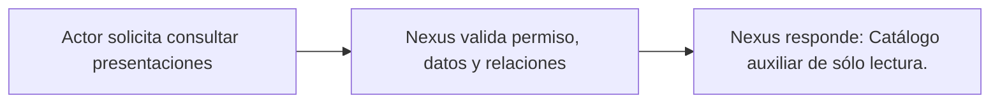

# `CU-CAT-27` — Consultar presentaciones

```mermaid
flowchart LR
    request["Actor solicita consultar presentaciones"] --> validate["Nexus valida permiso, datos y relaciones"]
    validate --> result["Nexus responde: Catálogo auxiliar de sólo lectura."]
```
