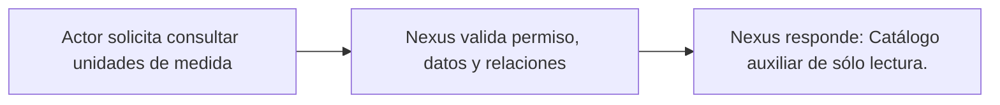

# `CU-CAT-28` — Consultar unidades de medida

```mermaid
flowchart LR
    request["Actor solicita consultar unidades de medida"] --> validate["Nexus valida permiso, datos y relaciones"]
    validate --> result["Nexus responde: Catálogo auxiliar de sólo lectura."]
```
