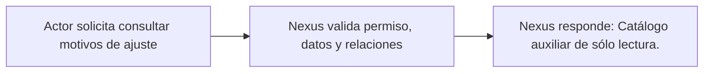

# `CU-CAT-29` — Consultar motivos de ajuste

```mermaid
flowchart LR
    request["Actor solicita consultar motivos de ajuste"] --> validate["Nexus valida permiso, datos y relaciones"]
    validate --> result["Nexus responde: Catálogo auxiliar de sólo lectura."]
```
