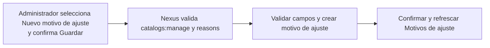

# `CU-CAT-38` — Crear motivo de ajuste

```mermaid
flowchart LR
    request["Administrador selecciona Nuevo motivo de ajuste<br/>y confirma Guardar"] --> authorize["Nexus valida catalogs:manage y reasons"]
    authorize --> persist["Validar campos y crear motivo de ajuste"]
    persist --> result["Confirmar y refrescar Motivos de ajuste"]
```
