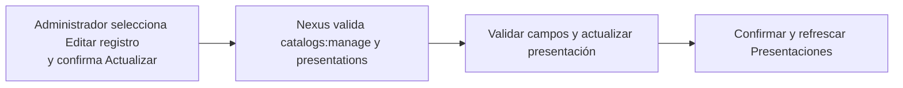

# `CU-CAT-39` — Editar presentación

```mermaid
flowchart LR
    request["Administrador selecciona Editar registro<br/>y confirma Actualizar"] --> authorize["Nexus valida catalogs:manage y presentations"]
    authorize --> persist["Validar campos y actualizar presentación"]
    persist --> result["Confirmar y refrescar Presentaciones"]
```
