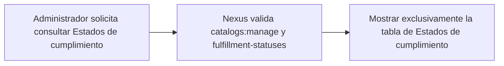

# `CU-CAT-40` — Consultar estado de cumplimiento

```mermaid
flowchart LR
    request["Administrador solicita consultar Estados de cumplimiento"] --> authorize["Nexus valida catalogs:manage y fulfillment-statuses"]
    authorize --> result["Mostrar exclusivamente la tabla de Estados de cumplimiento"]
```
