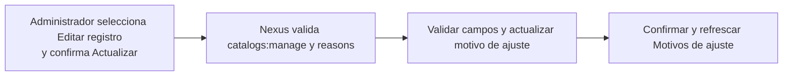

# `CU-CAT-45` — Editar motivo de ajuste

```mermaid
flowchart LR
    request["Administrador selecciona Editar registro<br/>y confirma Actualizar"] --> authorize["Nexus valida catalogs:manage y reasons"]
    authorize --> persist["Validar campos y actualizar motivo de ajuste"]
    persist --> result["Confirmar y refrescar Motivos de ajuste"]
```
