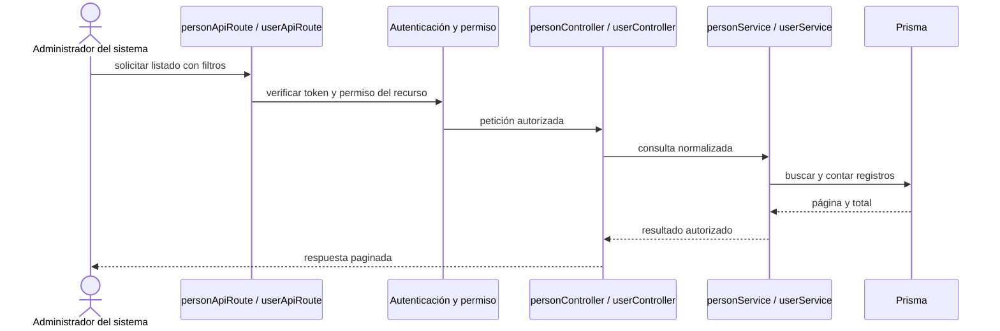

# 1. Consultar personas y usuarios — `CU-IDA-01` y `CU-IDA-05`

Personas y usuarios son consultas separadas y conservan permisos, filtros y forma de
respuesta propios. La vista omite el montaje completo de la URL, que permanece en el
mapa generado, y no implica que una consulta entregue credenciales.
