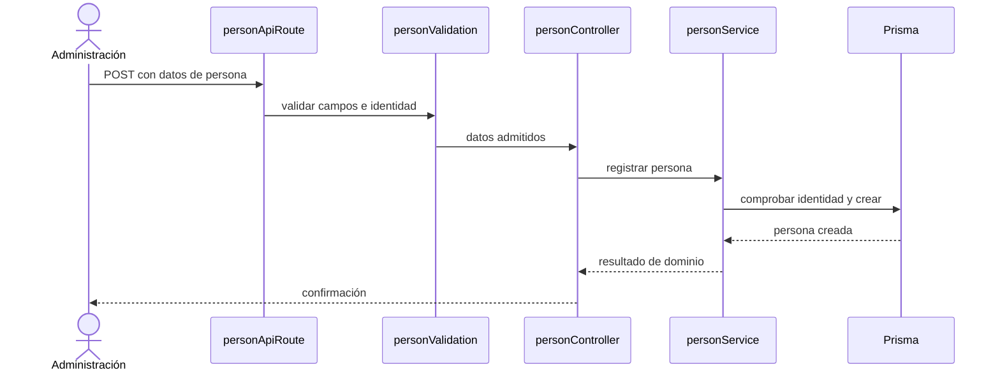

# Crear persona — `CU-IDA-02`

La validación de transporte ocurre antes del controller y la regla de identidad se
conserva en el servicio. El refresco del listado del diagrama funcional sucede en el
navegador después de esta respuesta y no es otra escritura.
