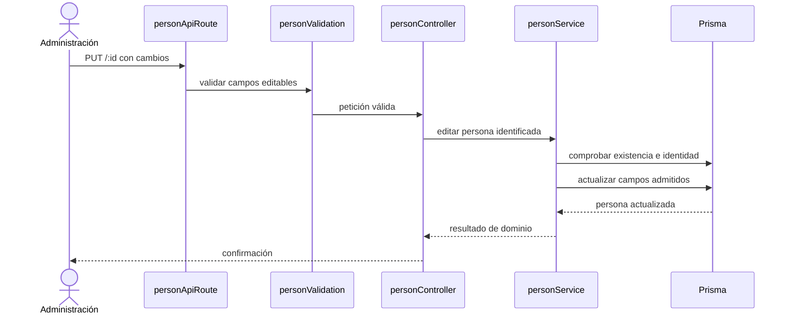

# 3. Editar persona — `CU-IDA-03`

La secuencia hace visible que la existencia y la identidad no se confían al formulario.
No muestra componentes EJS ni refresco de DataTable porque pertenecen a la presentación,
no a la actualización de dominio.
