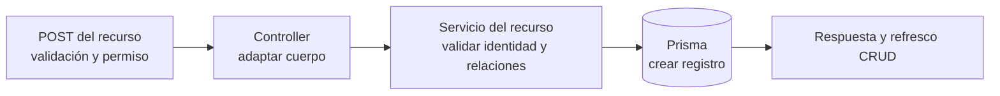

# 5. Patrón de alta de catálogos — `CU-ALM-02`, `CU-CAT-02`, `CU-CAT-07`, `CU-ALM-10`, `CU-CAT-11`, `CU-CAT-14`, `CU-CAT-17`, `CU-CAT-20`, `CU-CAT-23` y `CU-CAT-26`

Cliente, proveedor, material, merma y catálogos auxiliares recorren capas equivalentes. Los catálogos auxiliares reutilizan su registro con lista blanca; las relaciones y reglas de los demás recursos no se trasladan a esa configuración. El refresco final es
una reacción de `createCrudApplication`, no parte de la transacción de persistencia.
