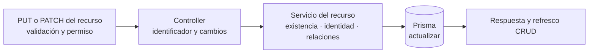

# 6. Patrón de edición de catálogos — `CU-ALM-03`, `CU-CAT-03`, `CU-CAT-07`, `CU-ALM-11`, `CU-CAT-11`, `CU-CAT-14`, `CU-CAT-17`, `CU-CAT-20`, `CU-CAT-23` y `CU-CAT-26`

El método HTTP y los campos editables dependen del router concreto. La vista sólo
reutiliza la cadena estable de capas y no supone que crear y editar tengan exactamente
las mismas validaciones.
