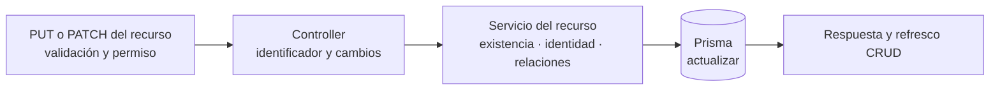

# 6. Patrón de edición de catálogos — `CU-ALM-03`, `CU-CAT-03`, `CU-CAT-08`, `CU-ALM-11`, `CU-CAT-12`, `CU-CAT-15`, `CU-CAT-18`, `CU-CAT-21`, `CU-CAT-24` y `CU-CAT-27`

El método HTTP y los campos editables dependen del router concreto. La vista sólo
reutiliza la cadena estable de capas y no supone que crear y editar tengan exactamente
las mismas validaciones.
