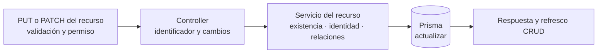

# 6. Patrón de edición de catálogos — `CU-CAT-03`, `CU-CAT-11`, `CU-CAT-16`, `CU-CAT-20`, `CU-CAT-27`, `CU-CAT-30`, `CU-CAT-33`, `CU-CAT-36`, `CU-CAT-39` y `CU-CAT-42`

El método HTTP y los campos editables dependen del router concreto. La vista sólo
reutiliza la cadena estable de capas y no supone que crear y editar tengan exactamente
las mismas validaciones.
