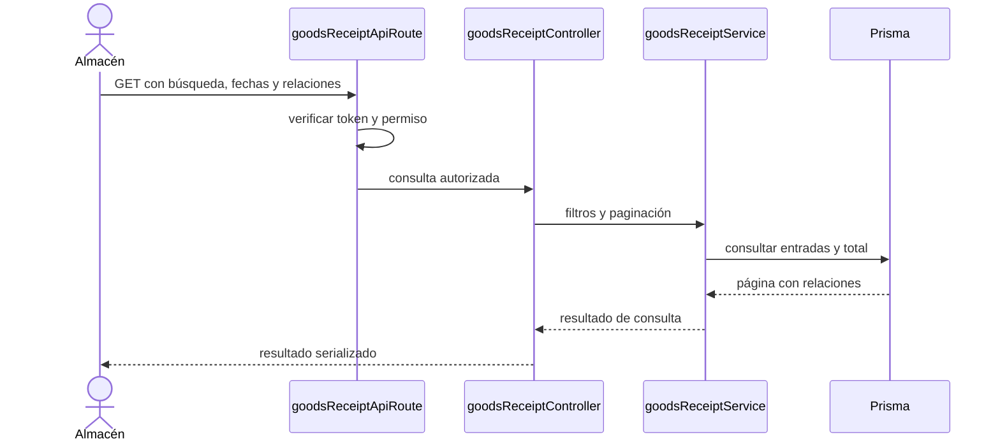

# Consultar compras de material — `CU-ENT-01`

La consulta no abre la transacción documental ni recalcula inventario. Los totales y
relaciones devueltos son proyecciones de lectura; el dibujo funcional los agrupa bajo
«mostrar página».
