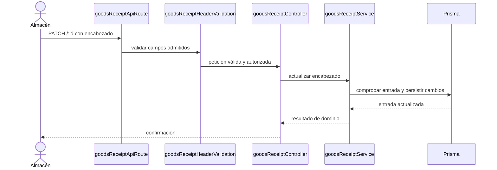

# 8. Editar compra de material — `CU-ENT-03`

La ruta vigente edita el encabezado y no vuelve a aplicar el stock de detalles ya
registrados. Agregar o corregir detalles usa operaciones distintas, por lo que no se
representan como efectos implícitos de esta secuencia.
