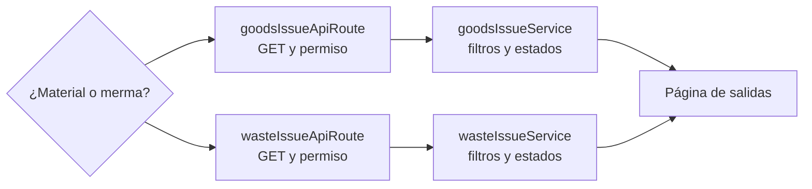

# Consultar salidas de material o de merma — `CU-SAL-01` y `CU-SAL-08`

La bifurcación es técnica además de funcional: cada contexto conserva router, permiso,
servicio e inventario propios. Compartir el resultado visual no significa consultar una
tabla o conversión única.
