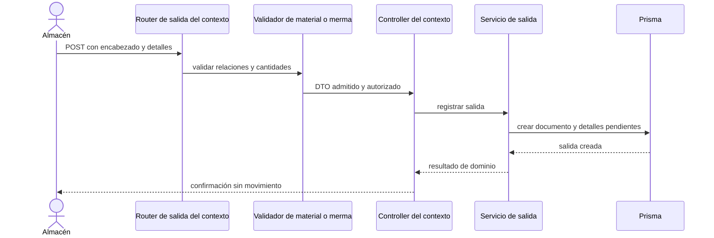

# 10. Crear salida de material o de merma — `CU-SAL-02` y `CU-SAL-09`

Crear la salida no descuenta inventario ni registra el movimiento de surtimiento. Esos
efectos comienzan al confirmar detalles en `CU-SAL-05`, aunque la interfaz presente ambos
pasos dentro del mismo módulo.
