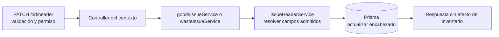

# 11. Editar encabezado de salida de material o de merma — `CU-SAL-03` y `CU-SAL-10`

`issueHeaderService` concentra la resolución compartida del encabezado y cada servicio
contextual conserva sus relaciones. La ruta general `PATCH /:id` es otra entrada del
contrato y no convierte esta edición en surtimiento.
