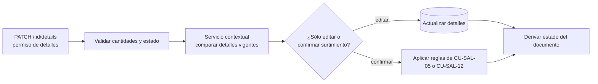

# Editar detalles de material o merma de una salida — `CU-SAL-04` y `CU-SAL-11`

No existe una URL `/supply`: en material, la misma entrada de detalles puede confirmar
el surtimiento según el estado y los datos recibidos. La rama de confirmación continúa
en la máquina de estados y en la transacción de `CU-SAL-05` o `CU-SAL-12`; no se duplica aquí.
