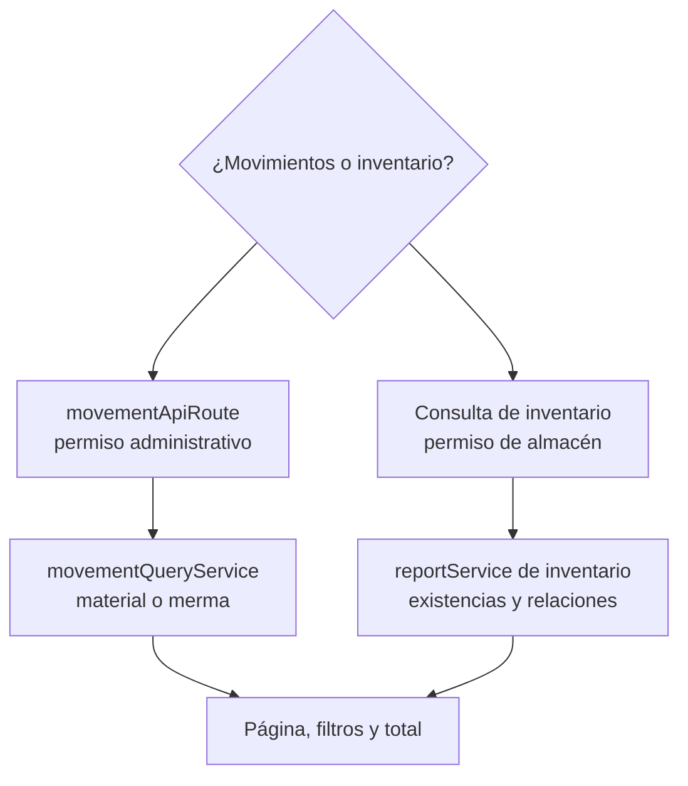

# 13. Consultar inventarios y movimientos — `CU-CAT-06`, `CU-CAT-08`, `CU-CAT-23` y `CU-CAT-25`

Movimientos e inventario son modelos de lectura diferentes y sólo comparten el objetivo
de consulta. Esta vista no incluye Excel: la exportación agrega transformación, columnas
y fórmulas y pertenece a `CU-IDA-04`, `CU-IDA-09`, `CU-CAT-07`, `CU-CAT-09`, `CU-CAT-14`, `CU-CAT-18`, `CU-CAT-24`, `CU-CAT-26`, `CU-ENT-06`, `CU-SAL-07` y `CU-SAL-14`.
