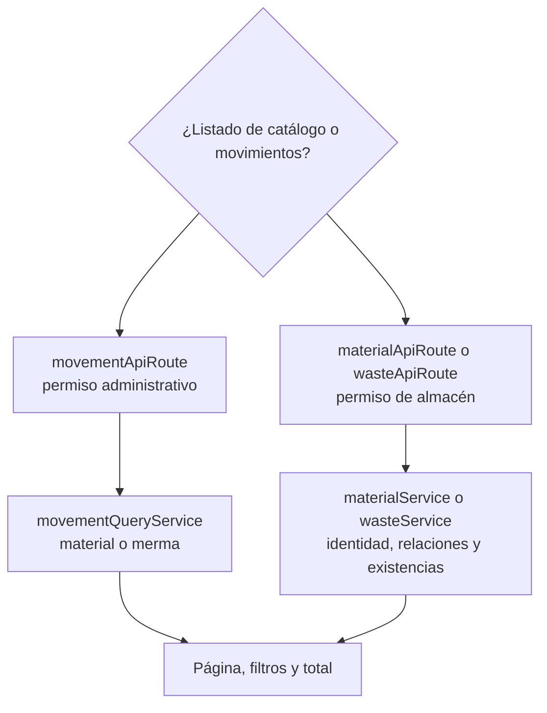

# 13. Consultar listados y movimientos — `CU-CAT-01`, `CU-CAT-07`, `CU-CAT-18` y `CU-CAT-23`

Materiales y mermas integran identidad, relaciones y existencias en un único listado; no
existe una segunda consulta de inventario. Los movimientos sí usan otro modelo de lectura
y conservan sus propios casos. Esta vista no incluye Excel: la exportación agrega
transformación, columnas y fórmulas y pertenece a `CU-IDA-04`, `CU-IDA-09`, `CU-CAT-06`,
`CU-CAT-08`, `CU-CAT-13`, `CU-CAT-17`, `CU-CAT-22`, `CU-CAT-24`, `CU-ENT-06`,
`CU-SAL-07` y `CU-SAL-14`.
