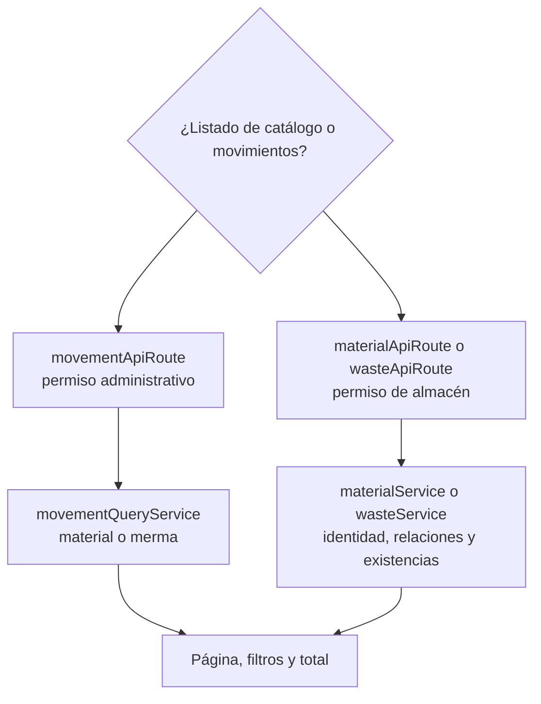

# 13. Consultar listados y movimientos — `CU-ALM-01`, `CU-ALM-07`, `CU-ALM-09` y `CU-ALM-15`

Materiales y mermas integran identidad, relaciones y existencias en un único listado; no
existe una segunda consulta de inventario. Los movimientos sí usan otro modelo de lectura
y conservan sus propios casos. Esta vista no incluye Excel: la exportación agrega
transformación, columnas y fórmulas y pertenece a `CU-IDA-04`, `CU-IDA-09`, `CU-ALM-06`,
`CU-ALM-08`, `CU-CAT-04`, `CU-CAT-08`, `CU-ALM-14`, `CU-ALM-16`, `CU-ENT-06`,
`CU-SAL-07` y `CU-SAL-14`.
