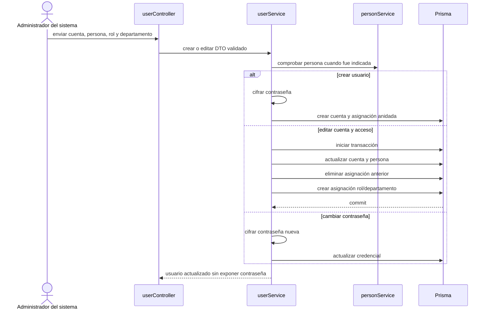

# 14. Crear o editar usuario y acceso — `CU-IDA-06`, `CU-IDA-07`, `CU-IDA-08`

La edición de cuenta no representa activación o desactivación: el router vigente ofrece
actualización general y cambio separado de contraseña. Si se incorpora un endpoint de
estado, deberá agregarse como caso o alternativa verificable antes de dibujar esa
transición.
