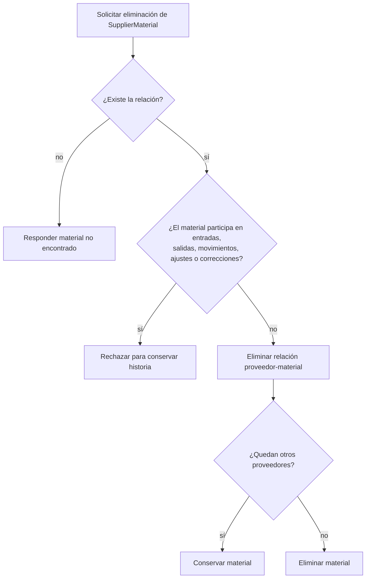

# 15. Eliminar material o relación de proveedor — `CU-CAT-04`

La comprobación y ambas eliminaciones pertenecen a una sola transacción. El listado
reutiliza las mismas relaciones de uso para mostrar `canDelete`; no mantiene una segunda
definición de qué significa «sin historia».
