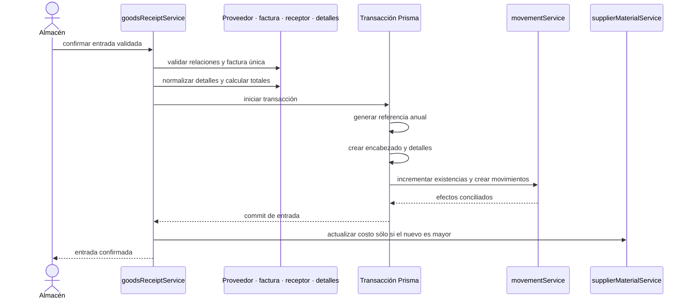

# 16. Crear compra de material — `CU-ENT-02`

El ajuste posterior del costo no se presenta como parte del límite atómico de documento,
stock y movimiento. Esta diferencia debe permanecer visible en pruebas y documentación.
