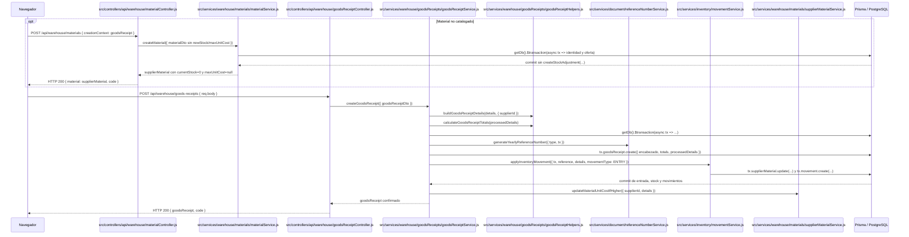

# 16. Crear compra de material — `CU-ENT-02`

El alta opcional de catálogo termina antes de confirmar la compra y no genera un ajuste de
existencia. El ajuste posterior del costo no se presenta como parte del límite atómico de
documento, stock y movimiento. Estas diferencias deben permanecer visibles en pruebas y
documentación.
