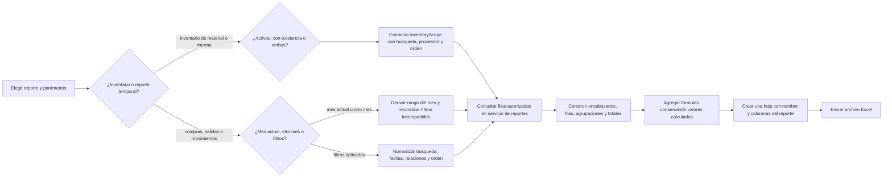

# 17. Generar reportes específicos — `CU-IDA-04`, `CU-IDA-09`, `CU-ALM-06`, `CU-ALM-08`, `CU-CAT-04`, `CU-CAT-08`, `CU-ALM-14`, `CU-ALM-16`, `CU-ENT-06`, `CU-SAL-07` y `CU-SAL-14`

Los inventarios no aplican selección mensual: su modal elige `inventoryScope`. Los
reportes temporales conservan mes actual, otro mes o filtros aplicados. Todos reutilizan
el canal consulta → transformación → Excel, pero
mantienen columnas, agrupación, fórmulas, permiso y nombre de hoja propios. Una nueva
variante replica ese proceso con configuración contextual antes de crear otro canal.
