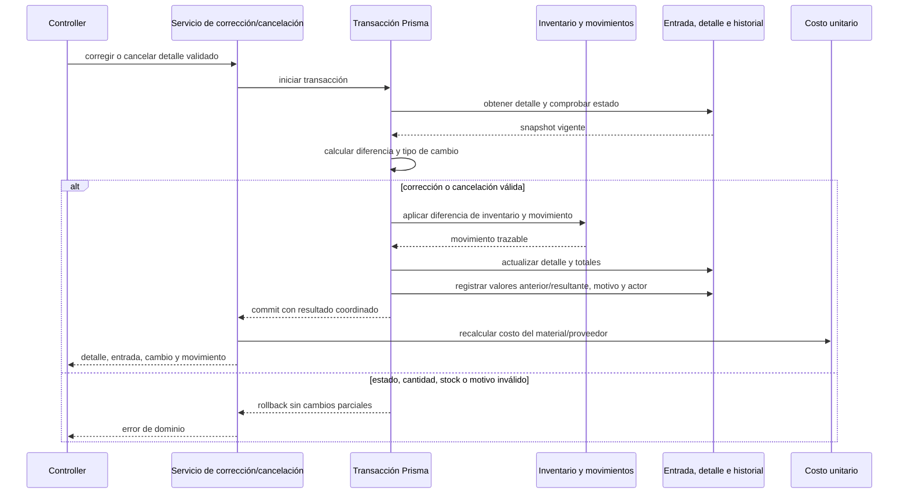

# Coordinación atómica de correcciones de entrada

Esta secuencia ayuda a desarrollo y pruebas a localizar el límite de `CU-ENT-04` y `CU-ENT-05`. Su alcance comienza después de autorizar y validar la petición y termina con la
respuesta del servicio. Los mensajes dentro del bloque **Transacción Prisma** son una
unidad: cualquier excepción revierte todos sus efectos. La actualización del costo
unitario ocurre después del commit y no forma parte de esa unidad.

Las flechas son llamadas coordinadas, no endpoints. La fuente verificable son
`goodsReceiptCorrectionService.js`, `goodsReceiptCancellationService.js` y sus ayudas de
inventario; el detalle contractual permanece en `CU-ENT-04` y `CU-ENT-05`. Si cambia el orden de las
escrituras, el límite transaccional o el recálculo posterior, deben actualizarse esta
vista y las pruebas unitarias ubicadas en la ruta paralela del servicio. El CRUD HTTP de
entradas conserva su cobertura de integración en `tests/integration/controllers`.
