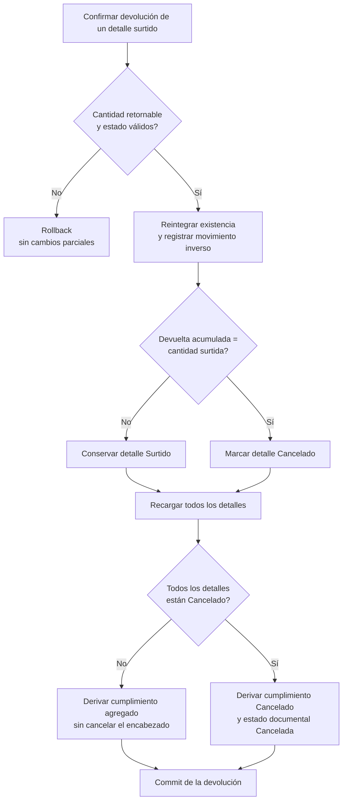

# 19. Derivación de la cancelación del encabezado

El siguiente diagrama separa la **operación de devolver** de la **transición derivada a
cancelado**, tanto para el detalle como para el encabezado. No existe una acción independiente
para cancelar una salida ni uno de sus detalles: la devolución confirmada siempre registra el
retorno y el movimiento inverso; sólo una devolución total deriva `Cancelado` para el detalle.
Después, el encabezado deriva cumplimiento `Cancelado` y estado documental `Cancelada`
únicamente cuando **todos** los detalles tienen cumplimiento `Cancelado`. La presencia de un
solo detalle pendiente, parcial o surtido impide cancelar la salida completa.

La fuente de verdad de los nombres y derivación de estados está en
`warehouseStatuses.js`, `issueFulfillmentRules.js` y las reglas específicas de cada
contexto; las transacciones de surtimiento y devolución son la evidencia de sus efectos.
Al modificar una fórmula, estado o regla de agregación se actualizan esta vista,
`CU-SAL-05`, `CU-SAL-06`, `CU-SAL-12`, `CU-SAL-13` y las pruebas paralelas de reglas y servicios. Las pruebas de
integración CRUD continúan en `tests/integration/controllers/*DbTest.js`, conforme a la
estrategia documentada, en vez de trasladarse junto al diagrama.
