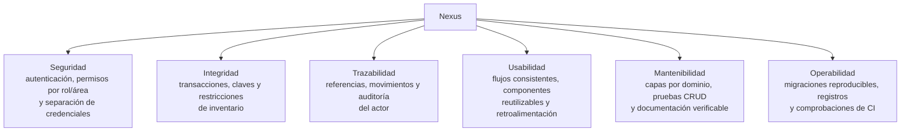

# 20. Requisitos de calidad y restricciones

```mermaid
flowchart TB
    nexus["Nexus"]
    security["Seguridad<br/>autenticación, permisos por rol/área<br/>y separación de credenciales"]
    integrity["Integridad<br/>transacciones, claves y restricciones<br/>de inventario"]
    traceability["Trazabilidad<br/>referencias, movimientos y auditoría<br/>del actor"]
    usability["Usabilidad<br/>flujos consistentes, componentes<br/>reutilizables y retroalimentación"]
    maintainability["Mantenibilidad<br/>capas por dominio, pruebas CRUD<br/>y documentación verificable"]
    operability["Operabilidad<br/>migraciones reproducibles, registros<br/>y comprobaciones de CI"]
    nexus --> security
    nexus --> integrity
    nexus --> traceability
    nexus --> usability
    nexus --> maintainability
    nexus --> operability
```
