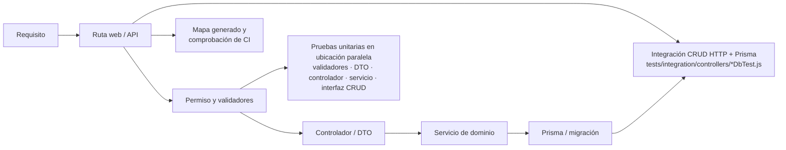

# Trazabilidad del requisito a la evidencia

Al modificar un requisito se revisan su ruta, autorización, validación, persistencia y
pruebas relacionadas. La ubicación y estrategia de estas últimas se detalla en
[Estrategia y cobertura de pruebas](../../../testing/service-test-coverage.md).
