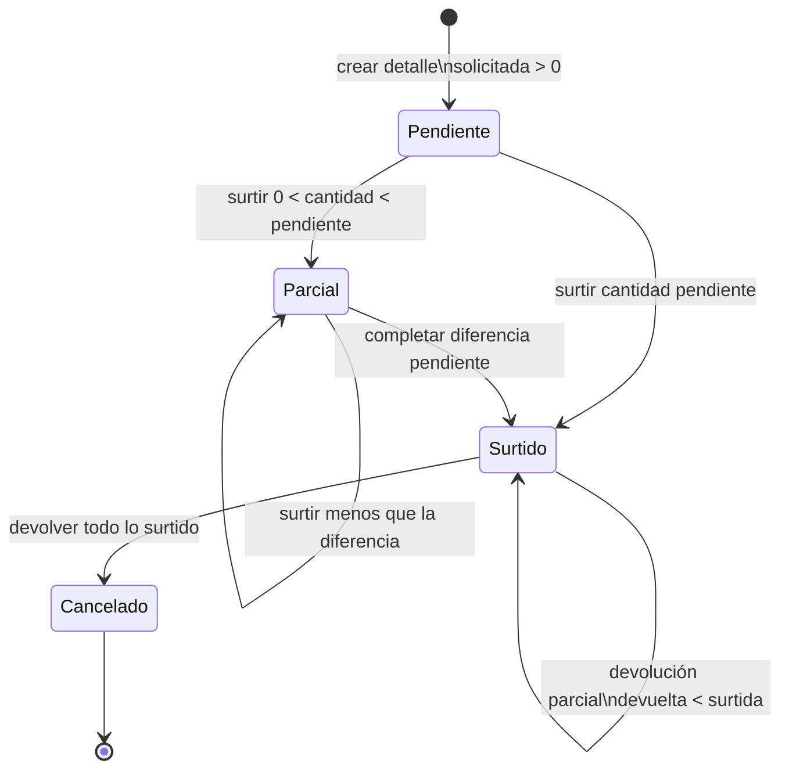

# Diagramas de requisitos — vistas transversales

## Casos con vistas adicionales y nivel de coordinación

La necesidad de otra vista se evaluó con cuatro señales: **cantidad de decisiones de
negocio**, **escrituras coordinadas**, **cambio de estado o acumulados** y **efecto que
debe revertirse ante un fallo**. Como todos los casos ya tienen un flujo funcional y una
vista técnica, **no se asigna una prioridad visual**: la cobertura no depende de atender
primero un caso. El nivel sólo clasifica la coordinación que debe conservar cada vista y
ayuda a elegir entre actividad, secuencia, decisión o máquina de estados cuando cambie
el código.

| Nivel de coordinación | Casos revisados | Motivo | Vista aplicada |
| --- | --- | --- | --- |
| Compleja | `CU-IDA-06`, `CU-IDA-07`, `CU-IDA-08` | Contraseña cifrada, persona opcional y asignación rol/departamento; al editar se reemplaza la asignación dentro de una transacción. | Secuencia de identidad y acceso incluida abajo. |
| Compleja | `CU-CAT-04` | La historia operativa impide eliminar; si quedan otros proveedores sólo se retira la relación proveedor-material. | Decisión de eliminación incluida abajo. |
| Compleja | `CU-ENT-02` | Referencia, documento, detalles, stock y movimientos se confirman juntos; el costo se revisa después del commit. | Secuencia de registro incluida abajo. |
| Compleja | `CU-ENT-04`, `CU-ENT-05` | Corrección/cancelación altera historia, totales, stock y movimiento. | Secuencia atómica ya incluida en este documento. |
| Compleja | `CU-SAL-05`, `CU-SAL-06`, `CU-SAL-12`, `CU-SAL-13` | Acumulados, estados, existencias y movimientos dependen de cantidades previas. | Máquina de estados ya incluida en este documento. |
| Compleja | `CU-IDA-04`, `CU-IDA-09`, `CU-CAT-07`, `CU-CAT-09`, `CU-CAT-14`, `CU-CAT-18`, `CU-CAT-24`, `CU-CAT-26`, `CU-ENT-06`, `CU-SAL-07` y `CU-SAL-14` | Filtros, variantes mensual/detallada, fórmulas, totales y archivo deben conservar el mismo resultado de dominio. | Canal de generación de reportes incluido abajo. |
| Intermedia | `CU-CAT-02`, `CU-CAT-03`, `CU-CAT-11`, `CU-CAT-12`, `CU-CAT-16`, `CU-CAT-17`, `CU-CAT-20`, `CU-CAT-21`, `CU-ENT-03`, `CU-SAL-02` a `CU-SAL-04` y `CU-SAL-09` a `CU-SAL-11` | Coordinan relaciones o detalles, pero no agregan participantes o estados que justifiquen una secuencia transaccional. | Flujo funcional en su grupo y vista técnica complementaria incluida abajo. |
| Directa | `CU-IDA-01` a `CU-IDA-03`, `CU-CAT-01`, `CU-CAT-10`, `CU-CAT-15`, `CU-CAT-19`, `CU-CAT-27` a `CU-CAT-44`, `CU-ENT-01`, `CU-SAL-01`, `CU-SAL-08`, `CU-CAT-06`, `CU-CAT-08`, `CU-CAT-23` y `CU-CAT-25` | Consulta o mutación directa sin estados coordinados adicionales. | Flujo funcional en su grupo y vista técnica complementaria incluida abajo. |

Las vistas siguientes completan los casos de coordinación intermedia y directa con el
mismo criterio aplicado a los casos de coordinación compleja: muestran la ejecución
entre capas y nombran el punto que el flujo funcional resumido no alcanza a representar.
No sustituyen los diagramas individuales anteriores; los complementan con una lectura
orientada al código.
- [1. Consultar personas y usuarios — `CU-IDA-01` y `CU-IDA-05`](01-consultar-personas-y-usuarios-cu-ida-01-y-cu-ida-05.md)
- [2. Crear persona — `CU-IDA-02`](02-crear-persona-cu-ida-02.md)
- [3. Editar persona — `CU-IDA-03`](03-editar-persona-cu-ida-03.md)
- [4. Patrón de consulta de catálogos — `CU-CAT-01`, `CU-CAT-10`, `CU-CAT-15`, `CU-CAT-19`; `CU-CAT-27`, `CU-CAT-30`, `CU-CAT-33`, `CU-CAT-36`, `CU-CAT-39` y `CU-CAT-42`](04-patron-de-consulta-de-catalogos-cu-cat-01-cu-cat-10-cu-cat-15-cu-cat-19-.md)
- [5. Patrón de alta de catálogos — `CU-CAT-02`, `CU-CAT-11`, `CU-CAT-16`, `CU-CAT-20`, `CU-CAT-28`, `CU-CAT-31`, `CU-CAT-34`, `CU-CAT-37`, `CU-CAT-40` y `CU-CAT-43`](05-patron-de-alta-de-catalogos-cu-cat-02-cu-cat-11-cu-cat-16-cu-cat-20-cu-c.md)
- [6. Patrón de edición de catálogos — `CU-CAT-03`, `CU-CAT-12`, `CU-CAT-17`, `CU-CAT-21`, `CU-CAT-29`, `CU-CAT-32`, `CU-CAT-35`, `CU-CAT-38`, `CU-CAT-41` y `CU-CAT-44`](06-patron-de-edicion-de-catalogos-cu-cat-03-cu-cat-12-cu-cat-17-cu-cat-21-c.md)
- [7. Consultar compras de material — `CU-ENT-01`](07-consultar-compras-de-material-cu-ent-01.md)
- [8. Editar compra de material — `CU-ENT-03`](08-editar-compra-de-material-cu-ent-03.md)
- [9. Consultar salidas de material o de merma — `CU-SAL-01` y `CU-SAL-08`](09-consultar-salidas-de-material-o-de-merma-cu-sal-01-y-cu-sal-08.md)
- [10. Crear salida de material o de merma — `CU-SAL-02` y `CU-SAL-09`](10-crear-salida-de-material-o-de-merma-cu-sal-02-y-cu-sal-09.md)
- [11. Editar encabezado de salida de material o de merma — `CU-SAL-03` y `CU-SAL-10`](11-editar-encabezado-de-salida-de-material-o-de-merma-cu-sal-03-y-cu-sal-10.md)
- [12. Editar detalles de material o merma de una salida — `CU-SAL-04` y `CU-SAL-11`](12-editar-detalles-de-material-o-merma-de-una-salida-cu-sal-04-y-cu-sal-11.md)
- [13. Consultar inventarios y movimientos — `CU-CAT-06`, `CU-CAT-08`, `CU-CAT-23` y `CU-CAT-25`](13-consultar-inventarios-y-movimientos-cu-cat-06-cu-cat-08-cu-cat-23-y-cu-c.md)
- [14. Crear o editar usuario y acceso — `CU-IDA-06`, `CU-IDA-07`, `CU-IDA-08`](14-crear-o-editar-usuario-y-acceso-cu-ida-06-cu-ida-07-cu-ida-08.md)
- [15. Eliminar material o relación de proveedor — `CU-CAT-04`](15-eliminar-material-o-relacion-de-proveedor-cu-cat-04.md)
- [16. Crear compra de material — `CU-ENT-02`](16-crear-compra-de-material-cu-ent-02.md)
- [17. Generar reportes específicos — `CU-IDA-04`, `CU-IDA-09`, `CU-CAT-07`, `CU-CAT-09`, `CU-CAT-14`, `CU-CAT-18`, `CU-CAT-24`, `CU-CAT-26`, `CU-ENT-06`, `CU-SAL-07` y `CU-SAL-14`](17-generar-reportes-especificos-cu-ida-04-cu-ida-09-cu-cat-07-cu-cat-09-cu-.md)

## Coordinación atómica de correcciones de entrada

- [18. Coordinación atómica de correcciones de entrada](18-coordinacion-atomica-de-correcciones-de-entrada.md)

## Estados de surtimiento y devolución

Esta máquina responde qué transición admite un detalle de `CU-SAL-05` y `CU-SAL-06`.
Aplica al proceso compartido de salidas de material y merma; el adaptador de cada
contexto resuelve inventario y conversión sin cambiar las invariantes. Una flecha es una
operación de negocio confirmada, no navegación ni una asignación directa del usuario.

En cada surtimiento se cumple `0 < cantidad ≤ solicitada − surtida`, se descuenta stock
y se crea un movimiento de salida. En cada devolución se cumple
`0 < cantidad ≤ surtida − devuelta`, se reintegra stock y se conserva el movimiento
original mediante un movimiento de entrada trazable. Después de cada transición se
deriva nuevamente el estado agregado del documento; si todos sus detalles quedan
cancelados, también se cancela el documento.
- [19. Derivación de la cancelación del encabezado](19-derivacion-de-la-cancelacion-del-encabezado.md)

## Requisitos de calidad y restricciones

- [20. Requisitos de calidad y restricciones](20-requisitos-de-calidad-y-restricciones.md)

## Trazabilidad del requisito a la evidencia

- [21. Trazabilidad del requisito a la evidencia](21-trazabilidad-del-requisito-a-la-evidencia.md)
