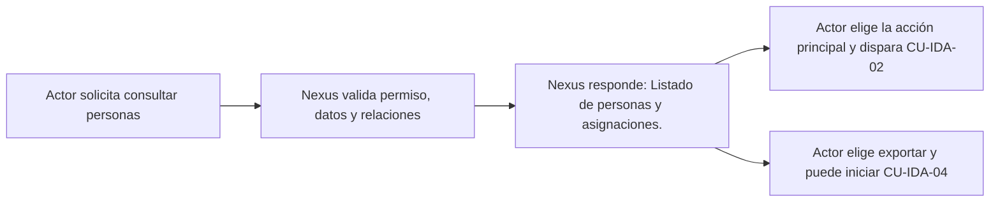

# `CU-IDA-01` — Consultar personas

```mermaid
flowchart LR
    accTitle: CU-IDA-01 — Consultar personas
    request["Actor solicita consultar personas"] --> validate["Nexus valida permiso, datos y relaciones"]
    validate --> result["Nexus responde: Listado de personas y asignaciones."]
    result --> primary["Actor elige la acción principal y dispara CU-IDA-02"]
    result --> report["Actor elige exportar y puede iniciar CU-IDA-04"]
```
