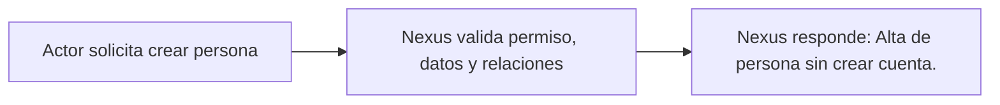

# `CU-IDA-02` — Crear persona

```mermaid
flowchart LR
    accTitle: CU-IDA-02 — Crear persona
    request["Actor solicita crear persona"] --> validate["Nexus valida permiso, datos y relaciones"]
    validate --> result["Nexus responde: Alta de persona sin crear cuenta."]
```
