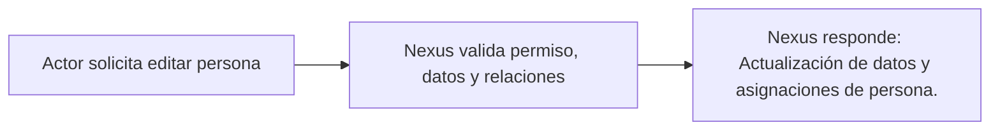

# `CU-IDA-03` — Editar persona

```mermaid
flowchart LR
    accTitle: CU-IDA-03 — Editar persona
    request["Actor solicita editar persona"] --> validate["Nexus valida permiso, datos y relaciones"]
    validate --> result["Nexus responde: Actualización de datos y asignaciones de persona."]
```
