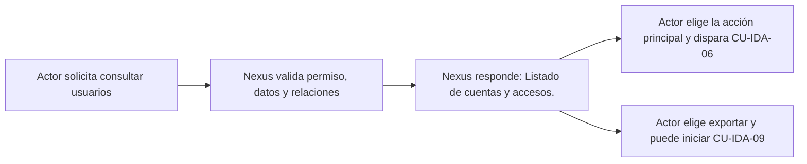

# `CU-IDA-05` — Consultar usuarios

```mermaid
flowchart LR
    accTitle: CU-IDA-05 — Consultar usuarios
    request["Actor solicita consultar usuarios"] --> validate["Nexus valida permiso, datos y relaciones"]
    validate --> result["Nexus responde: Listado de cuentas y accesos."]
    result --> primary["Actor elige la acción principal y dispara CU-IDA-06"]
    result --> report["Actor elige exportar y puede iniciar CU-IDA-09"]
```
