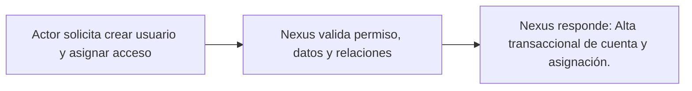

# `CU-IDA-06` — Crear usuario y asignar acceso

```mermaid
flowchart LR
    accTitle: CU-IDA-06 — Crear usuario y asignar acceso
    request["Actor solicita crear usuario y asignar acceso"] --> validate["Nexus valida permiso, datos y relaciones"]
    validate --> result["Nexus responde: Alta transaccional de cuenta y asignación."]
```
