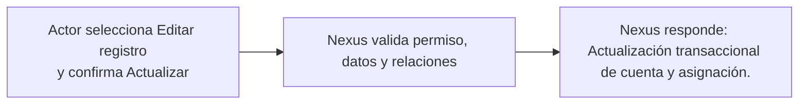

# `CU-IDA-07` — Editar usuario y acceso

```mermaid
flowchart LR
    accTitle: CU-IDA-07 — Editar usuario y acceso
    request["Actor selecciona Editar registro<br/>y confirma Actualizar"] --> validate["Nexus valida permiso, datos y relaciones"]
    validate --> result["Nexus responde: Actualización transaccional de cuenta y asignación."]
```
