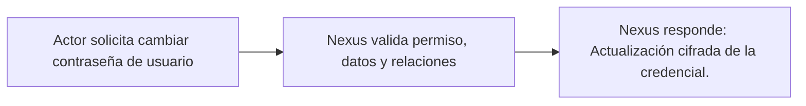

# `CU-IDA-08` — Cambiar contraseña de usuario

```mermaid
flowchart LR
    request["Actor solicita cambiar contraseña de usuario"] --> validate["Nexus valida permiso, datos y relaciones"]
    validate --> result["Nexus responde: Actualización cifrada de la credencial."]
```
