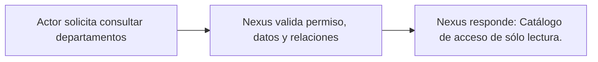

# `CU-IDA-11` — Consultar departamentos

```mermaid
flowchart LR
    request["Actor solicita consultar departamentos"] --> validate["Nexus valida permiso, datos y relaciones"]
    validate --> result["Nexus responde: Catálogo de acceso de sólo lectura."]
```
