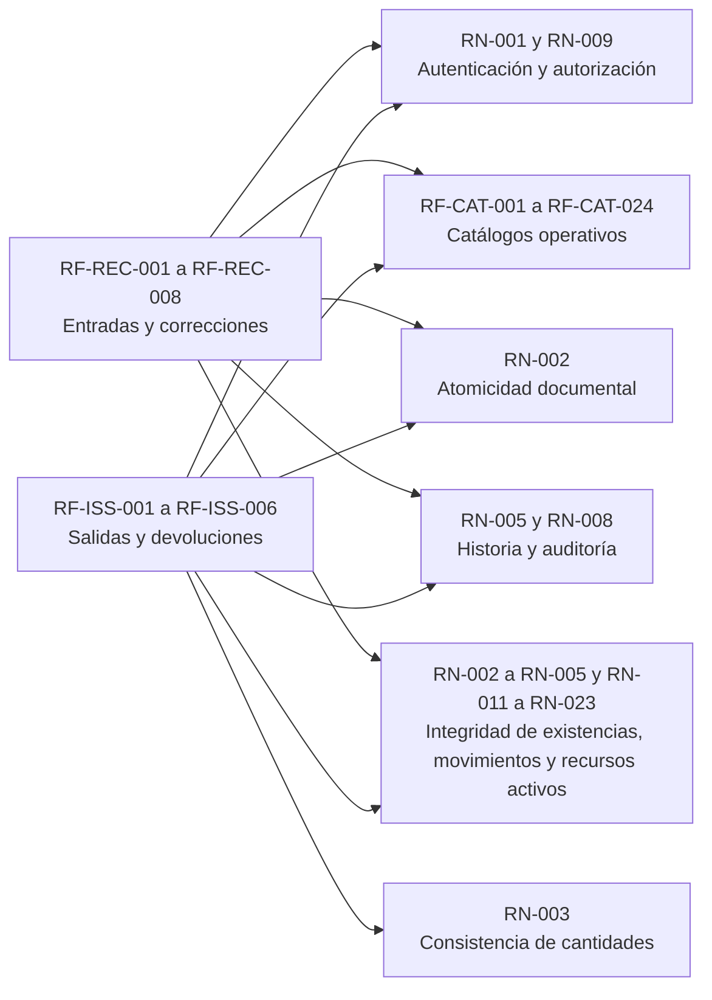
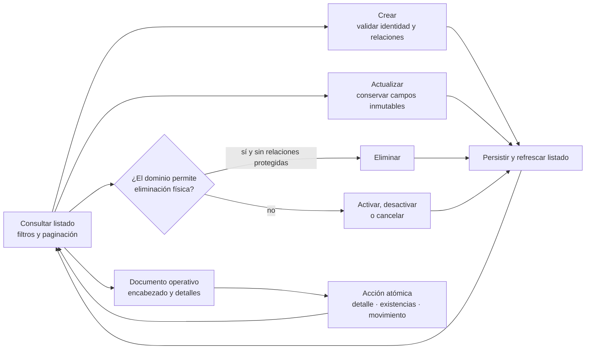
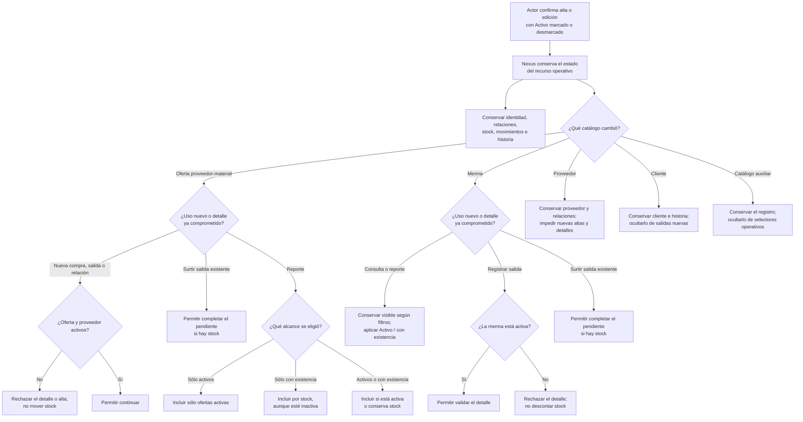

# Diagramas de requisitos

Este documento resume visualmente el alcance observable de Nexus y relaciona actores,
capacidades y atributos de calidad. La definición, estado, criterios de aceptación y
reglas de negocio se detallan en la
[especificación de requisitos](../requirements-specification/index.md). Este archivo es un mapa
para conversación y revisión: las rutas del
[mapa generado](../../generated/code-map.md), el esquema Prisma y las pruebas siguen siendo
las fuentes verificables de implementación. Estas vistas aplican las
[convenciones y patrones para diagramas](../../architecture/diagram-conventions/index.md): cada sección conserva
un propósito, alcance, semántica y fuente de verdad definidos.

## Vista de requisitos y dependencias

Esta vista contiene **requisitos**, no actores ni casos de uso. Las operaciones del
usuario se muestran exclusivamente en el [diagrama de casos de uso](../domain-and-use-cases.md#casos-de-uso-vigentes). Una flecha `A --> B` significa que el cumplimiento de `A`
depende de `B`; no representa navegación, permiso ni interacción humana.

El texto verificable y el estado de cada identificador se mantienen una sola vez en la
[especificación](../requirements-specification/04-catalogo-unificado-por-ambito/index.md#4-catálogo-unificado-por-ámbito). La
[matriz de operaciones](../requirements-operations-matrix.md#matriz-vigente) documenta los
permisos, y el mapa generado documenta las rutas; repetirlos aquí mezclaría vistas.

## Ciclo vigente de los requisitos CRUD

Los catálogos reutilizan un mismo ciclo de interacción, con autorización y validación
particulares según el recurso. La eliminación física sólo aparece cuando las relaciones
del dominio la permiten; en los demás casos el ciclo usa activación, desactivación o
cancelación. Los documentos operativos reutilizan listado y formulario, pero agregan
acciones de detalle, existencias y movimientos sin presentarlas como un CRUD idéntico.

Las flechas representan transiciones observables del usuario, no rutas concretas de la API.
La bifurcación de eliminación aplica `RN-007`; el límite atómico aplica `RN-002`. La
matriz de operaciones define cuál de estas ramas existe realmente para cada módulo.

## Impacto del estado activo en los procesos de almacén

**Diagrama:** `DIA-REQ-ACT-001`. Esta actividad distingue el indicador de catálogo
`isActive` de los estados de documentos y muestra únicamente efectos comprobados en los
procesos vigentes. Una línea hacia «conservar» significa que cambiar la casilla no
ejecuta esa operación.

Se usa un **diagrama de actividad con nodos de decisión** porque la pregunta funcional es
qué camino sigue el caso según el estado del recurso. Un diagrama de estados sugeriría
incorrectamente que `isActive` es el estado del documento, y una secuencia duplicaría la
coordinación entre capas que ya se conserva en los diagramas backend y frontend. Las
vistas individuales de los casos afectados reutilizan abajo la misma decisión en su
contexto concreto.

La desactivación impide incorporar el recurso en una nueva compra, salida, merma o
relación aplicable, pero no cancela compromisos ya registrados. Si una salida quedó
**Surtido parcial** y después se desactiva la oferta proveedor-material, la merma o el proveedor, Nexus
permite surtir sus detalles pendientes usando el snapshot del documento, siempre que
haya stock. Así puede cerrarse la solicitud sin habilitar usos nuevos; si no debe
entregarse, se conserva pendiente hasta que el negocio defina una cancelación, pues
desactivar el catálogo no cancela automáticamente el documento. Los reportes de
inventario de material y merma aplican el alcance elegido: **Sólo activos**, **Sólo con
existencia** o **Activos o con existencia**.
Clientes y proveedores son catálogos comerciales con módulos propios; Áreas, Roles,
Presentaciones, Unidades de medida, Motivos de ajuste y Estados de cumplimiento son
catálogos auxiliares administrados mediante el patrón compartido. En ambos grupos la
desactivación conserva historia y la administración mantiene visibles los registros para
permitir su reactivación.

Los estados **Pendiente**, **Surtido parcial**, **Surtido** y **Cancelado** pertenecen a
documentos y se derivan en otra máquina de estados; no dependen de `isActive`.

## Revisión de flujos y nivel de detalle

La revisión del catálogo de casos de uso y de los servicios coordinadores distingue los
flujos que pueden reutilizar el ciclo CRUD anterior de aquellos cuya consistencia depende
de varias cantidades, estados o escrituras. Cada caso tiene una vista propia para poder
seguirlo de principio a fin; la reutilización consiste en conservar la misma estructura
y señalar sus diferencias, no en omitir el caso.

| Área revisada | Complejidad observada | Decisión visual |
| --- | --- | --- |
| Personas, usuarios y catálogos | Validación y política de eliminación propias, pero transición CRUD común. | Crear una vista por caso reutilizando la estructura **seleccionar operación → validar → persistir → refrescar**. |
| Creación y edición de documentos | Encabezado y detalles varían por contexto, pero siguen el límite transaccional ya representado. | Crear una vista por caso y hacer explícito cuándo cambia el inventario. |
| Corrección o cancelación de una entrada | Debe conciliar snapshot, diferencia de cantidad, stock, movimiento, totales e historial en una sola transacción. | Agregar una secuencia de coordinación atómica. |
| Surtimiento y devolución de una salida | La cantidad solicitada, surtida y devuelta determina estados de detalle y documento; una devolución crea además un movimiento inverso. | Agregar una máquina de estados con invariantes cuantitativas. |
| Material frente a merma | El proceso es equivalente, aunque cambian inventario, conversión y reglas contextuales. | Un mismo caso muestra la bifurcación de contexto y el proceso compartido. |
| Consultas, filtros y exportación | No modifica estados y combina filtros, paginación y formatos de salida. | Crear una vista propia de consulta sin presentarla como escritura CRUD. |

Esta clasificación se revisa cuando un caso de uso incorpora una bifurcación, una
transacción con un nuevo efecto persistente o una transición de estado. Los diagramas
por caso reutilizan nodos y semántica cuando el proceso es equivalente, mientras los
diagramas de secuencia o estados se reservan para explicar coordinación adicional.

## Organización visual de los casos

Los flujos conservan los cinco grupos funcionales propietarios del catálogo y se leen
dentro de las familias por entidad definidas en el
[criterio de agrupación vigente](../use-cases/index.md#criterio-de-agrupación-vigente).
La familia sólo permite localizar casos relacionados: cada encabezado y cada diagrama
siguiente sigue representando una acción sobre una entidad concreta. El primer nodo
nombra al actor como iniciador y corresponde al disparador de la ficha; los nodos
siguientes identifican las respuestas de Nexus.

## Flujos de cada caso de uso

Cada vista comienza con un identificador `CU-<FAMILIA>-<SECUENCIA>` y representa
exclusivamente ese objetivo. Los encabezados conservan los grupos funcionales
propietarios y sus identificadores secuenciales; cada reporte se ubica inmediatamente
junto a la consulta que lo inicia. Los diagramas reutilizan la misma semántica cuando el
proceso es equivalente, pero no agrupan objetivos distintos en una
sola vista. Las flechas resumen los pasos
observables y no representan endpoints. El recorrido contrastado contra vista, router,
controller y servicio se conserva en la sección
inferencia de pasos desde la implementación,
y la fuente curada de cada ficha es el
[catálogo operativo](../use-cases/index.md#catálogo-operativo-y-granularidad).

## Diagramas por grupo funcional

- [AUT — Autenticación](authentication/index.md)
- [IDA — Identidad y acceso](identity-access/index.md)
- [CAT — Catálogos](catalogs/index.md)
- [ENT — Compras de material](purchases/index.md)
- [SAL — Salidas de material y de merma](issues/index.md)
- [Vistas transversales y restricciones](cross-cutting/index.md)
