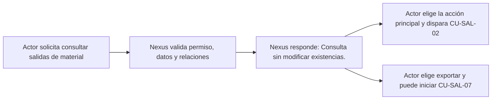

# `CU-SAL-01` — Consultar salidas de material

```mermaid
flowchart LR
    accTitle: CU-SAL-01 — Consultar salidas de material
    request["Actor solicita consultar salidas de material"] --> validate["Nexus valida permiso, datos y relaciones"]
    validate --> result["Nexus responde: Consulta sin modificar existencias."]
    result --> primary["Actor elige la acción principal y dispara CU-SAL-02"]
    result --> report["Actor elige exportar y puede iniciar CU-SAL-07"]
```
