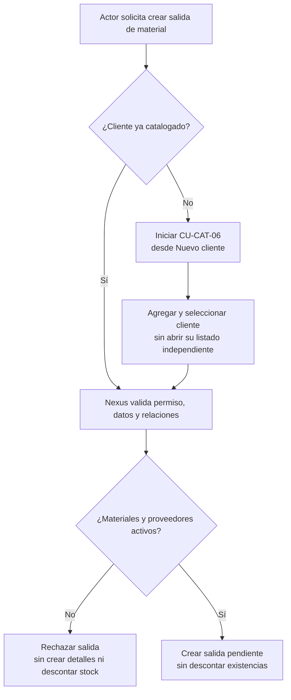

# `CU-SAL-02` — Crear salida de material

```mermaid
flowchart TD
    accTitle: CU-SAL-02 — Crear salida de material
    request["Actor solicita crear salida de material"] --> client{"¿Cliente ya catalogado?"}
    client -->|No| createClient["Iniciar CU-CAT-06<br/>desde Nuevo cliente"]
    createClient --> selectClient["Agregar y seleccionar cliente<br/>sin abrir su listado independiente"]
    client -->|Sí| validate["Nexus valida permiso, datos y relaciones"]
    selectClient --> validate
    validate --> active{"¿Materiales y proveedores activos?"}
    active -->|No| reject["Rechazar salida<br/>sin crear detalles ni descontar stock"]
    active -->|Sí| result["Crear salida pendiente<br/>sin descontar existencias"]
```
