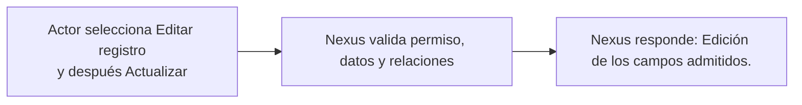

# `CU-SAL-03` — Editar encabezado de salida de material

```mermaid
flowchart LR
    accTitle: CU-SAL-03 — Editar encabezado de salida de material
    request["Actor selecciona Editar registro<br/>y después Actualizar"] --> validate["Nexus valida permiso, datos y relaciones"]
    validate --> result["Nexus responde: Edición de los campos admitidos."]
```
