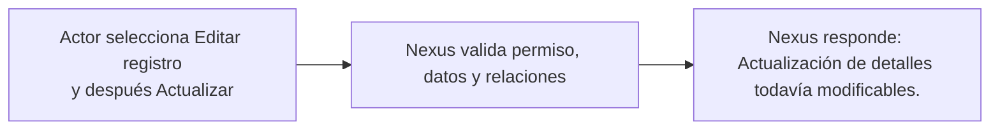

# `CU-SAL-04` — Editar detalles de material de una salida

```mermaid
flowchart LR
    request["Actor selecciona Editar registro<br/>y después Actualizar"] --> validate["Nexus valida permiso, datos y relaciones"]
    validate --> result["Nexus responde: Actualización de detalles todavía modificables."]
```
