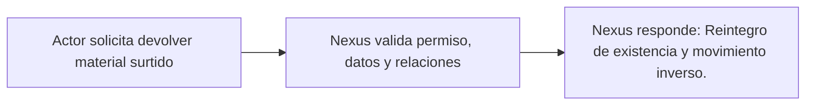

# `CU-SAL-06` — Devolver material surtido

```mermaid
flowchart LR
    accTitle: CU-SAL-06 — Devolver material surtido
    request["Actor solicita devolver material surtido"] --> validate["Nexus valida permiso, datos y relaciones"]
    validate --> result["Nexus responde: Reintegro de existencia y movimiento inverso."]
```
