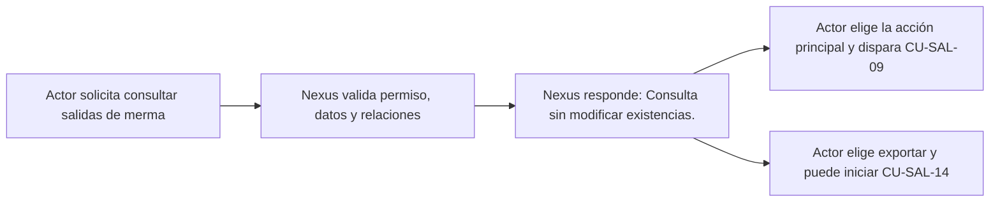

# `CU-SAL-08` — Consultar salidas de merma

```mermaid
flowchart LR
    accTitle: CU-SAL-08 — Consultar salidas de merma
    request["Actor solicita consultar salidas de merma"] --> validate["Nexus valida permiso, datos y relaciones"]
    validate --> result["Nexus responde: Consulta sin modificar existencias."]
    result --> primary["Actor elige la acción principal y dispara CU-SAL-09"]
    result --> report["Actor elige exportar y puede iniciar CU-SAL-14"]
```
