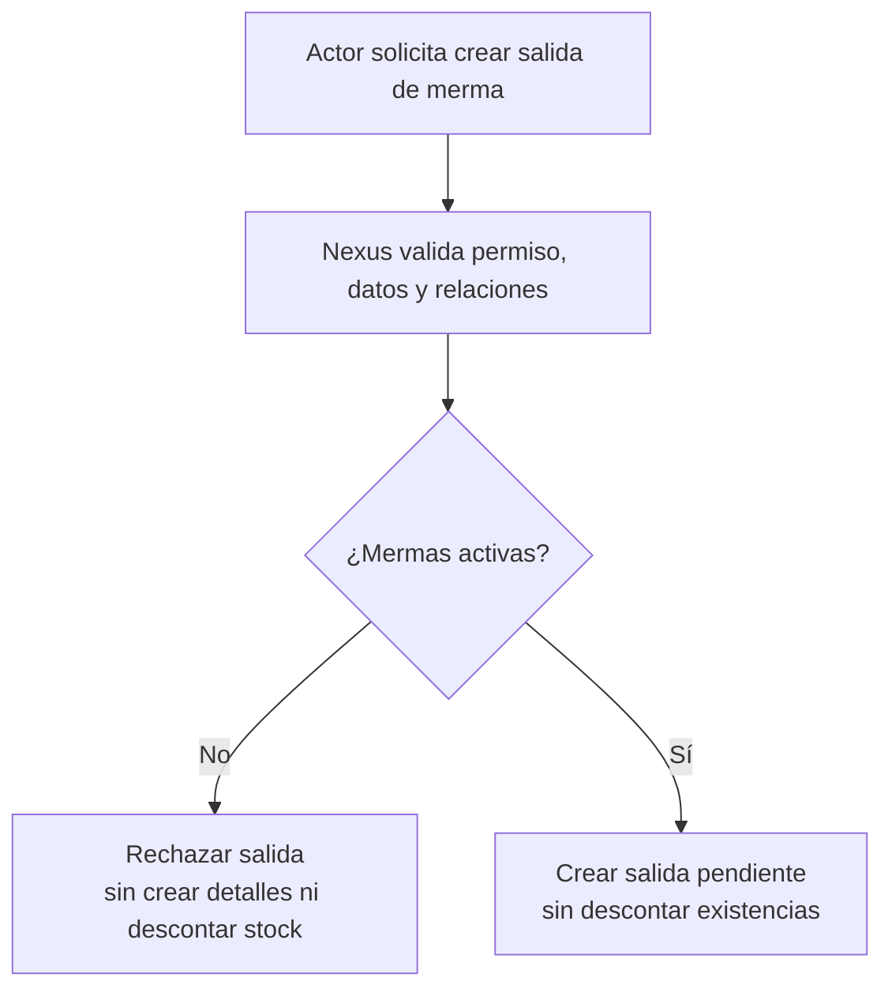

# `CU-SAL-09` — Crear salida de merma

```mermaid
flowchart TD
    request["Actor solicita crear salida de merma"] --> validate["Nexus valida permiso, datos y relaciones"]
    validate --> active{"¿Mermas activas?"}
    active -->|No| reject["Rechazar salida<br/>sin crear detalles ni descontar stock"]
    active -->|Sí| result["Crear salida pendiente<br/>sin descontar existencias"]
```
