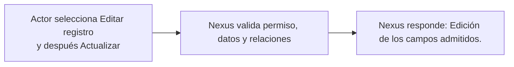

# `CU-SAL-10` — Editar encabezado de salida de merma

```mermaid
flowchart LR
    request["Actor selecciona Editar registro<br/>y después Actualizar"] --> validate["Nexus valida permiso, datos y relaciones"]
    validate --> result["Nexus responde: Edición de los campos admitidos."]
```
